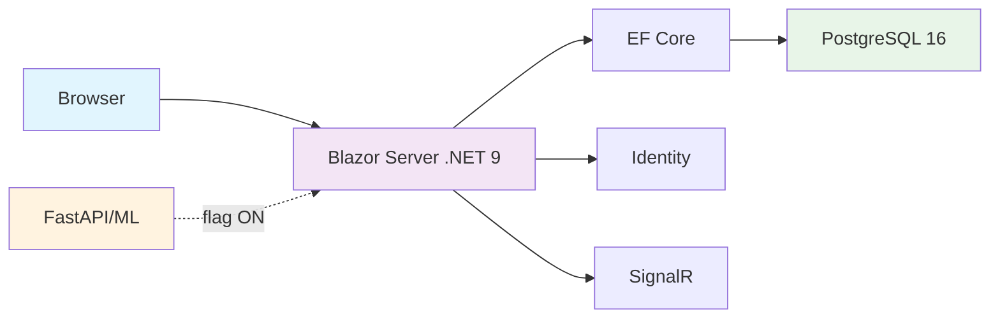

# 🚀 BudgetPilot v1 — Smart Personal Finance Manager

[](https://github.com/riccardomerenda/BudgetPilot/actions/workflows/ci.yml)
[](https://github.com/riccardomerenda/BudgetPilot/actions/workflows/ci.yml)
[](LICENSE)

<!-- Badge tecnologici (informativi) -->
[](https://dotnet.microsoft.com/)
[](https://dotnet.microsoft.com/apps/aspnet/web-apps/blazor)
[](https://www.postgresql.org/)
[](https://www.docker.com/)

<!-- Badge di stato progetto -->
[](https://github.com/riccardomerenda/BudgetPilot)
[](https://github.com/riccardomerenda/BudgetPilot/pulls)

> **🎯 Privacy-first PFM domestico** per famiglia (2 utenti) con **Blazor Server + PostgreSQL**
> 
> **MVP solido in 7-14 giorni** con rilasci settimanali e moduli avanzati dietro **feature-flag**

---

## ✨ Caratteristiche MVP (v1)

### 📊 Dashboard Intelligente
- **KPI in tempo reale**: entrate, uscite, risparmi
- **Budget 50/30/20**: visualizzazione progressi con grafici interattivi
- **Ultime transazioni**: cronologia recente con filtri rapidi
- **Metriche performance**: <200ms di caricamento

### 💳 Gestione Transazioni
- **CRUD completo**: inserimento, modifica, eliminazione
- **Filtri avanzati**: per mese, categoria, account
- **Auto-categorizzazione**: regole intelligenti per classificazione automatica
- **Ricerca veloce**: <100ms per inserimento

### 💰 Budget Configurabile
- **Percentuali personalizzabili**: oltre il classico 50/30/20
- **Mapping categoria→bucket**: configurazione flessibile
- **Tracking progressi**: visualizzazione real-time degli obiettivi

### 📁 Import/Export Avanzato
- **Export CSV UTF-8**: compatibilità universale
- **Import con preview**: anteprima prima dell'importazione
- **De-duplicazione intelligente**: via `(FamilyId, ImportHash)`
- **Regole v0**: keyword/merchant con explain in preview
- **Performance**: import 1000 righe in <30s

---

## 🔮 Moduli Avanzati (Feature-Flag)

| Modulo | Status | Descrizione |
|--------|--------|-------------|
| 🤖 **AI Advisor** | `flag: false` | Auto-categoria ML ≥75%, Q&A numerico, anomaly detection |
| 🧾 **730** | `flag: false` | Documenti fiscali, stime automatiche |
| 📈 **Investimenti** | `flag: false` | Tracking portfolio, performance analysis |
| 📊 **Report Avanzati** | `flag: false` | PDF/Excel, analisi trend, forecasting |

---

## 🏗️ Architettura



### 🎯 Principi di Design
- **Semplicità > completezza**: prima i flussi base, poi la potenza
- **MVP-first**: demo settimanali con metriche chiare
- **Privacy by default**: dati locali, export on-demand
- **Zero-ops**: monolite Blazor Server + Postgres (Docker)
- **Feature-flags**: moduli rischiosi/avanzati isolati

---

## 🚀 Quick Start

### Prerequisiti
- [.NET 9 SDK](https://dotnet.microsoft.com/download/dotnet/9.0)
- [Docker Desktop](https://www.docker.com/products/docker-desktop)
- [Git](https://git-scm.com/)

### Setup Rapido

```bash
# 1. Clone del repository
git clone https://github.com/riccardomerenda/BudgetPilot.git
cd BudgetPilot

# 2. Avvio database PostgreSQL + Adminer
docker compose up -d

# 3. Setup applicazione (migrazioni già incluse)
cd BudgetPilot.Web
dotnet tool install --global dotnet-ef
dotnet ef database update
dotnet run
```

Nota: l'auto-migrate all'avvio è disabilitato. Esegui manualmente `dotnet ef database update` nelle fasi di setup/deploy.

### 🎯 Accesso
- **Applicazione**: https://localhost:7148
- **Admin Database**: http://localhost:8080
- **Demo User**: `demo@budgetpilot.ai` / `Demo123!`

---

## ⚙️ Configurazione

### Feature Flags
```json
{
  "FeatureFlags": {
    "AiAdvisor": false,
    "Tax730": false, 
    "Investments": false,
    "Reports": false
  }
}
```

### Database
```json
{
  "ConnectionStrings": {
    "DefaultConnection": "Host=localhost;Port=5432;Database=budgetpilot;Username=postgres;Password=postgres"
  }
}
```

### Multi-tenant (dev)
- Isolamento per `FamilyId` via query filters.
- Impostazione tenant durante lo sviluppo:
  - Header HTTP: `X-Family-Id: <GUID>`
  - Oppure claim utente: `family_id = <GUID>`

---

## 📈 Performance Target

| Operazione | Target | Status |
|------------|--------|--------|
| Dashboard | < **200ms** | 🟡 In sviluppo |
| Insert transazione | < **100ms** | 🟡 In sviluppo |
| Import 1000 righe | < **30s** | 🟡 In sviluppo |
| Memoria RAM | < **150MB** | 🟡 In sviluppo |

---

## 🔒 Sicurezza

- **Isolamento multi-tenant**: query filter per `FamilyId`
- **HTTPS enforcement**: in produzione
- **EF Core parametri**: prevenzione SQL injection
- **XSS mitigato**: grazie a Blazor Server
- **Logging sicuro**: Serilog con rotazione file

---

## 🧪 Test & CI/CD

```bash
# Test locali
dotnet test --collect:"XPlat Code Coverage"

# Build CI
dotnet build --configuration Release
```

### GitHub Actions
- ✅ Build automatico su push/PR
- ✅ Test unitari e integrazione
- ✅ Code coverage con reportgenerator
- ✅ Upload coverage su Codecov
- ✅ Artefatti per analisi
- ✅ Health endpoint `/health` con timestamp
- ✅ Code formatting checks

---

## 🗺️ Roadmap (EU/Rome Timezone)

| Milestone | Periodo | Deliverable |
|-----------|---------|-------------|
| **M0 — Foundation** | 21-24 ago 2025 | ✅ Bootstrap, seed deterministico, mockup |
| **M1 — Core MVP** | 25-31 ago 2025 | 🟡 CRUD + dashboard + export CSV |
| **M2 — Budget & Import** | 1-7 set 2025 | 🔴 Budget + import CSV (preview + de-dup) |
| **M3 — AI Base** | 8-14 set 2025 | 🔴 Auto-categoria ML ≥75% *(flag)* |
| **M4 — Moduli Avanzati** | 15-28 set 2025 | 🔴 730, Investimenti, Report *(flag)* |

### Definition of Done (MVP)
- ✅ Build pulita
- ✅ Seed deterministico
- ✅ Dati isolati per famiglia
- 🟡 Dashboard funzionante
- 🔴 CRUD + export
- 🔴 Import con preview & de-dup
- 🔴 Test minimi
- 🔴 README aggiornato

---

## 🏗️ Struttura Progetto

```
BudgetPilot/
├── 📁 BudgetPilot.Web/           # Blazor Server App (.NET 9)
│   ├── 📁 Data/                  # EF Core + Entities
│   ├── 📁 Services/              # Business Logic
│   ├── 📁 Pages/                 # Blazor Pages
│   ├── 📁 Components/            # Shared Components
│   └── 📁 wwwroot/               # Static Files
├── 📁 BudgetPilot.Tests/         # Unit & Integration Tests
├── 📁 .github/                   # CI/CD Workflows
├── 📄 docker-compose.yml         # PostgreSQL + Adminer
└── 📄 BudgetPilot.sln            # Solution File
```

---

## 🤝 Contributi

Siamo aperti a contributi! Ecco come:

dotnet1. **Fork** il repository
2. **Crea** un branch per la feature (`git checkout -b feature/AmazingFeature`)
3. **Commit** le modifiche (`git commit -m 'Add AmazingFeature'`)
4. **Push** al branch (`git push origin feature/AmazingFeature`)
5. **Apri** una Pull Request

### 🐛 Bug Report
Usa le [GitHub Issues](https://github.com/riccardomerenda/BudgetPilot/issues) per segnalare bug o richiedere nuove funzionalità.

---

## 📄 Licenza

Distribuito sotto licenza MIT. Vedi `LICENSE` per maggiori informazioni.

---

## 🙏 Ringraziamenti

- **.NET Team** per Blazor Server
- **PostgreSQL** per il database robusto
- **Community** per feedback e contributi

---

<div align="center">

**⭐ Se questo progetto ti è utile, considera di dargli una stella!**

[](https://github.com/riccardomerenda/BudgetPilot/stargazers)
[](https://github.com/riccardomerenda/BudgetPilot/network/members)

</div>
